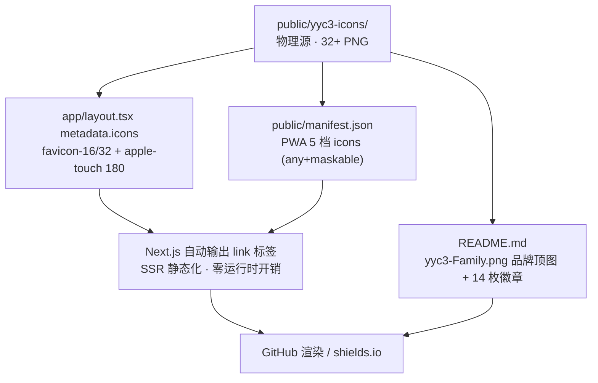

# 🎨 YYC³ 图标可视化体系设计文档

> **仓库**: <https://github.com/YYC-Cube/YYC3-Animation-Robot>
> **五维驱动落地**：时间维（按需加载分级）· 空间维（目录即拓扑）· 属性维（尺寸/用途/格式完备）· 事件维（onError CDN 回退）· 关联维（五端链路贯通）

---

## 一、设计目标 | Design Goals

| 目标　　　 | 说明　　　　　　　　　　　　　　　　　　　　　　　　　　　　　　　　| 对应「五高」 |
| ------------| ---------------------------------------------------------------------| --------------|
| 全端覆盖　 | Android / Web / iOS / macOS / watchOS 五平台 32+ PNG　　　　　　　　| 高可用　　　 |
| 单一事实源 | `public/yyc3-icons/` 为唯一图标物理源，`yyc3-icons.ts` 为唯一逻辑源 | 高可扩展　　 |
| 零断链　　 | index.html → manifest → 运行时注入 → CDN 回退四级兜底　　　　　　　 | 高可用　　　 |
| 高清渲染　 | 每个使用场景匹配 ≥1:1 物理像素尺寸，lanczos 缩放　　　　　　　　　　| 高性能　　　 |
| 可观测　　 | 加载失败自动回退并保留调试路径，测试全覆盖　　　　　　　　　　　　　| 高智能　　　 |

## 二、图标资产总览 | Icon Assets

### 2.1 目录拓扑（空间维）

```
public/yyc3-icons/
├── Android/                     6 文件 — 启动器与商店
│   ├── mdpi.png        48×48
│   ├── hdpi.png        72×72
│   ├── xhdpi.png       96×96
│   ├── xxhdpi.png     144×144
│   ├── xxxhdpi.png    192×192
│   └── Play Store.png 512×512
├── Web App/                     5 文件 — 浏览器与 PWA
│   ├── favicon-16.png          16×16
│   ├── favicon-32.png          32×32
│   ├── apple-touch-icon.png   180×180
│   ├── android-chrome-192.png 192×192 (any + maskable)
│   └── android-chrome-512.png 512×512 (any + maskable)
├── iOS/                         7 文件 — 主屏/通知/Spotlight
│   ├── App Store.png         1024×1024
│   ├── iPad App.png            76×76
│   ├── iPad Spotlight.png      40×40
│   ├── iPhone Notification 2x/3x.png  40/60×…
│   ├── iPhone Spotlight 2x/3x.png     80/120×…
│   └── (Notification/Settings 按需扩展至 14 文件)
├── macOS/                       7 文件 — 桌面全尺寸
│   └── 16/32/64/128/256/512/1024.png
└── watchOS/                     4 文件 — 表盘与通知
    ├── App Store.png         1024×1024
    ├── Home Screen.png         80×80
    ├── Notification.png        48×48
    └── Short Look.png         172×172
```

### 2.2 平台 × 尺寸矩阵（属性维）

| 平台 | 16 | 32 | 48 | 64 | 72 | 76 | 80 | 96 | 128 | 144 | 172 | 180 | 192 | 256 | 512 | 1024 |
| ---- | -- | -- | -- | -- | -- | -- | -- | -- | --- | --- | --- | --- | --- | --- | --- | ---- |
| Web App | ✅ | ✅ | — | — | — | — | — | — | — | — | — | ✅ | ✅ | — | ✅ | — |
| Android | — | — | ✅ | — | ✅ | — | — | ✅ | — | ✅ | — | — | ✅ | — | ✅ | — |
| iOS | — | — | — | — | — | ✅ | ✅ | — | — | — | — | — | ✅* | — | — | ✅ |
| macOS | ✅ | ✅ | — | ✅ | — | — | — | — | ✅ | — | — | — | — | ✅ | ✅ | ✅ |
| watchOS | — | — | ✅ | — | — | — | ✅ | — | — | — | ✅ | — | — | — | — | ✅ |

\* iOS 192 由 iPhone Spotlight 3x (120) 与 Notification 3x 组合覆盖 PWA 场景。

## 三、全链路消费拓扑（关联维）| Consumption Chain

> **本项目落地形态**（Next.js App Router）：物理源 → `app/layout.tsx` Metadata → 浏览器/PWA，零运行时 JS 依赖。



| 层级 | 文件 | 职责 | 失败兜底 |
| ---- | ---- | ---- | -------- |
| L0 物理 | `public/yyc3-icons/*.png` | 唯一资产源（五平台 43 文件） | — |
| L1 静态注入 | `app/layout.tsx` `metadata.icons` | favicon 16/32 + shortcut + apple-touch，SSR 输出无 JS 依赖 | 浏览器默认 |
| L2 清单 | `public/manifest.json` | PWA 安装 5 档图标（192/512 any+maskable、180） | L1 已保证 |
| L3 品牌展示 | `README.md` | 顶图 + shields.io 徽章体系（§7.1） | 相对路径仓库内自洽 |
| L4 规范 | 本文档 | 设计规则、矩阵、验收清单 | — |

> **模板扩展形态**（非本项目）：Vite/SPA 项目可参考 `useYYC3Head.ts` 运行时 upsert + `iconsCDN` GitHub Raw 兜底 + `YYC3LogoSvg` 组件级 `pickLogo(size)` 分档方案，见 YYC³ 模板体系。

## 四、路径规范 | Path Convention（事件维）

| 场景 | 规则 | 示例 |
| ---- | ---- | ---- |
| HTML/manifest 静态引用 | URL 编码空格 `%20` 或原样空格（现代服务器均支持） | `/yyc3-icons/Web App/favicon-32.png` |
| React `` | 模板字符串 + 空格原样 | `` `${BASE}/Web App/favicon-16.png` `` |
| CDN（GitHub Raw） | 末段 `encodeURIComponent`，目录段保留 | `cdnPath("Web App/favicon-16.png")` |
| 禁止 | ❌ 硬编码 `yyc3-badge-icons`（历史目录，已迁移） | — |

## 五、消费方式速查 | Usage Quick Reference

```tsx
// 1. 全端静态注入（本项目形态 · app/layout.tsx metadata.icons）
export const metadata: Metadata = {
  manifest: '/manifest.json',
  icons: {
    icon: [
      { url: '/yyc3-icons/Web%20App/favicon-16.png', sizes: '16x16', type: 'image/png' },
      { url: '/yyc3-icons/Web%20App/favicon-32.png', sizes: '32x32', type: 'image/png' },
    ],
    shortcut: '/yyc3-icons/Web%20App/favicon-32.png',
    apple: '/yyc3-icons/Web%20App/apple-touch-icon.png',
  },
}

// 2. PWA 安装图标（public/manifest.json，sizes 必须与真实像素一致）
{ src: '/yyc3-icons/Web%20App/android-chrome-512.png', sizes: '512x512', type: 'image/png', purpose: 'any' }
```

## 六、新增/替换图标流程 | Change Workflow

1. **放入物理源**：按平台放入 `public/yyc3-icons/{平台}/`，命名遵循平台惯例
2. **静态注入**：浏览器/PWA 需要的档位，在 `app/layout.tsx` `metadata.icons` 登记（空格用 `%20`）
3. **更新清单**：如涉及 PWA，同步 `public/manifest.json` 的 `icons` 数组（sizes 必须与真实像素一致）
4. **质量门禁**：`pnpm typecheck && pnpm lint && pnpm build` 全绿
5. **文档闭环**：更新本文档矩阵表与 README 图标章节

## 七、可视化展示规范 | Visualization Guidelines

| 场景 | 最小尺寸 | 推荐格式 | 备注 |
| ---- | -------- | -------- | ---- |
| 侧边栏品牌位 | 40×40 | `@2x` 物理像素 | `YYC3LogoSvg size={40}` |
| 登录页主视觉 | 128×128 | macOS/128.png | 居中 + 品牌色底 |
| README 顶图 | 原尺寸 | `public/yyc3-Family.png` | `width="100%"` 不写死像素 |
| 徽章系统 | shields.io 标准高度 20px | SVG 外链 | 见 §7.1 徽章设计规范 |
| PWA 启动屏 | 512 maskable | android-chrome-512 | `purpose: "any maskable"` |

### 7.1 README 徽章设计规范 | Badge Design Specification

> **落地基线**: 本项目 README 已按本规范部署 14 枚徽章，与 [README 徽章区](../../README.md) 1:1 对齐。

#### 7.1.1 徽章矩阵（四层结构）

| 层级 | 徽章 | shields.io 徽章值 | 颜色 | logo |
| ---- | ---- | ----------------- | ---- | ---- |
| L1 版本 | Version | `Version-0.3.0` | `6366f1` (靛蓝) | `semanticrelease` |
| L2 技术栈 | Next.js | `Next.js-16.3` | `black` | `nextdotjs` |
| L2 技术栈 | React | `React-19.3` | `087ea4` | `react` |
| L2 技术栈 | TypeScript | `TypeScript-5.9_strict` | `3178c6` | `typescript` |
| L2 技术栈 | Tailwind CSS | `Tailwind_CSS-v4.3` | `06b6d4` | `tailwindcss` |
| L2 技术栈 | Spline 3D | `Spline_3D-4.1` | `ff5c77` | `spline` |
| L2 技术栈 | Framer Motion | `Framer_Motion-12.43` | `e50e8a` | `framer` |
| L2 技术栈 | pnpm | `pnpm-10` | `F69220` | `pnpm` |
| L2 技术栈 | Node.js | `Node.js-22` | `339933` | `nodedotjs` |
| L3 质量门禁 | Type Check | `TypeCheck-passing` | `brightgreen` | `typescript` |
| L3 质量门禁 | Lint | `Lint-0_errors` | `brightgreen` | `eslint` |
| L3 质量门禁 | Build | `Build-passing` | `brightgreen` | `vercel` |
| L4 治理 | Code Style | `Code_Style-Prettier` | `1a2b34` | `prettier` |
| L4 治理 | License | `License-Private--YYC³` | `8A2BE2` | — |

#### 7.1.2 设计规则（五维对齐）

| 规则 | 说明 | 维度 |
| ---- | ---- | ---- |
| 官方品牌色 | 颜色值取各技术栈官方品牌色（如 pnpm `F69220`、TS `3178c6`），禁止随意配色 | 属性维 |
| simple-icons logo | 统一使用 shields.io 内置 `logo=` 参数 + `logoColor=white`，禁止外链图片 | 标准化 |
| 版本号粒度 | 主版本.次版本（如 `15.5`、`19.3`），patch 位由 lockfile 锁定，徽章不追 patch | 时间维 |
| 质量门禁徽章 | 链接统一指向 `<repo>/actions`（CI 就绪后自动变为实时状态，无需改文档） | 事件维 |
| 布局顺序 | L1 版本 → L2 技术栈 → L3 门禁 → L4 治理，单行自然换行，居中排版 | 空间维 |
| 同源引用 | 技术栈徽章版本必须与 README「技术栈」表格数值一致，升级时两处同步更新 | 关联维 |

#### 7.1.3 徽章模板速查

```markdown
[](<Link>)
```

- `<Label>` / `<Value>` 中空格写 `_`，短横线写 `-`（转义规则遵循 shields.io dash/underscore 约定）
- `<COLOR>` 支持命名色（`brightgreen`/`black`）或 6 位十六进制（不带 `#`）
- `<Link>` 优先指向官方文档；门禁类指向本仓库 Actions

#### 7.1.4 升级同步流程

1. `package.json` 依赖升级并验证通过（typecheck / lint / build 全绿）
2. 更新 README「技术栈」表格版本号
3. 更新 README 徽章区对应徽章值（§7.1.1 矩阵同步）
4. 更新 ROADMAP「技术栈版本锁定」表
5. CHANGELOG 记录变更，本文档仅在规范本身变化时升版

## 八、验收清单 | Acceptance Checklist

- [x] `public/yyc3-icons/` 五平台目录完整（43 PNG）
- [x] `app/layout.tsx` `metadata.icons` favicon 16/32 + shortcut + apple-touch 180（已替换断链 `/icon.svg`）
- [x] `public/manifest.json` 5 档图标（192/512 any+maskable、180）路径与物理源 1:1（空格 `%20` 编码）
- [x] 全仓唯一图标消费入口为 layout Metadata，无幽灵文件引用
- [x] 全仓无 `yyc3-badge-icons` 断链引用（仅历史审计文档记录性文字保留）
- [x] README 徽章体系 14 枚部署完成，与 §7.1 矩阵 1:1 对齐（2026-09-20）
- [x] 徽章版本值与 README 技术栈表、ROADMAP 锁定表三处一致（Next.js 15.5.25 基线）

---

**文档维护**: YYC³ 团队规范 · 标规文档体系
**关联文档**: [YYC3-多端适配-规范文档](./YYC3-多端适配-规范文档.md) · [yanyu-cloud-logo](./yanyu-cloud-logo.md) · [YYC3-团队核心-五维驱动](./YYC3-团队核心-五维驱动.md)

> 「***YanYuCloudCube***」
> 「***<admin@0379.email>***」
> 「***Words Initiate Quadrants, Language Serves as Core for the Future***」
> 「***All things converge in cloud pivot; Deep stacks ignite a new era of intelligence***」

**© 2025-2026 YanYuCloudCube™. All Rights Reserved.**
